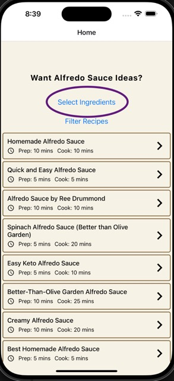
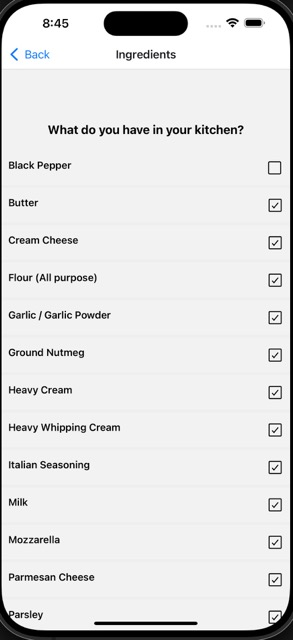
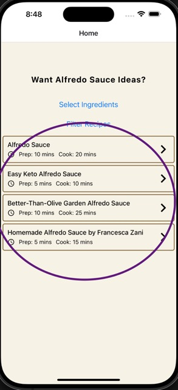
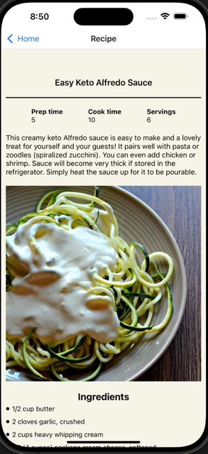

# REACT NATIVE - ASSIGNMENT 1

## Alfredo Sauce Selection helper

The app lists Alfredo sauce recipes based on what the user has in their kitchen.

### Step 1

First, select your ingredients. The app will use the ingredient list to filter out suitable recipes.

Then mark your ingredients

### Step 2

View the available recipes list. It takes 2 seconds to load the list and the list is shuffled.

### Step 3

Press on each recipe and go to recipe details.

